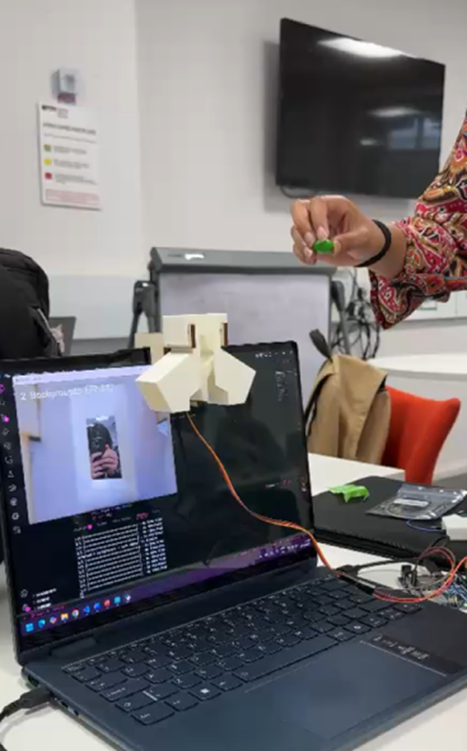

# Lil-Sorty

Welcome to our Designathon Project! This is Lil Sorty, as the name suggests, our little candy sorter. 
<p align="center">
  
  
</p>

## What it does

This little candy sorter is going to sort your candy into different colours after being trained on what to do. 
It is going to use a machine learning model trained using Google's Teachable Machine software, the steps on how to do this are as follows:

## Prequisites
1. Install Python 3.10.11 from https://www.python.org/downloads/release/python-31011/
2. Install the requirements.txt using ```pip install requirements.txt```
3. Install the Arduino IDE from https://docs.arduino.cc/software/ide/
4. Follow the steps from https://teachablemachine.withgoogle.com/ to train your own model and download your model! (or use the one in the models folder already set up)

## Equipment
1x Lil Sorty ;) <br>
1x Laptop <br>
1x Arduino Uno <br>
3x Male to Male Jumper Wires 

## Instructions

1. Connect the Arduino to the micro servo using the male-to-male jumper wires <br>
•	<span style="color:red">*Red* </span> into 5V <br>
•	<span style="color:brown">*Brown* </span> into GND next to Red <br>
•	<span style="color:orange">*Orange* </span> into ~9 <br>
2. Connect the other ends to the servo motor corresponding to the same coloured wires.
3. Connect the Arduino to the laptop using the USB to USB-C cable.
4. Paste the code from 'hardware/sorter_servo.ino' into the Arduino IDE and compile and upload onto the Arduino.
5. Run the python script in 'src/main.py'
6. Place Lil Sorty over your laptop webcam as shown below and watch Lil Sorty do its magic!

<p align="center">
  
</p>