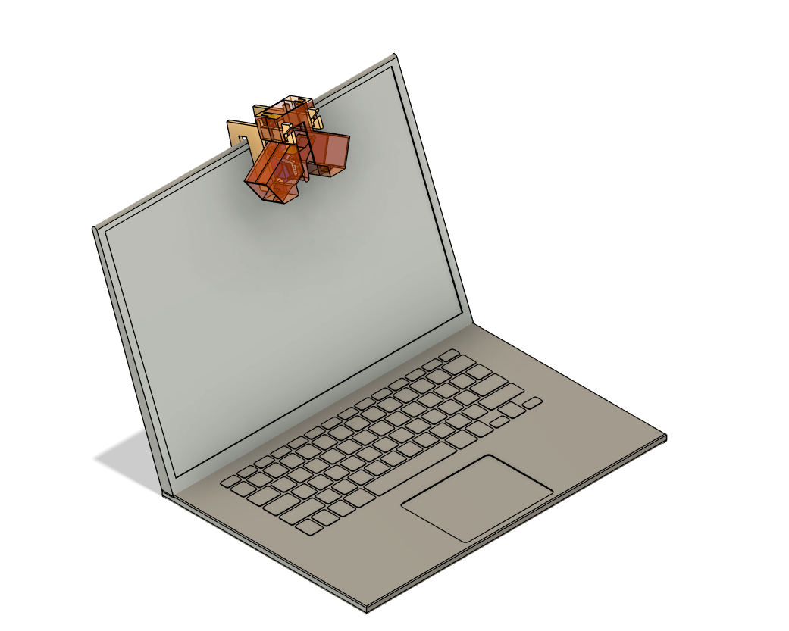
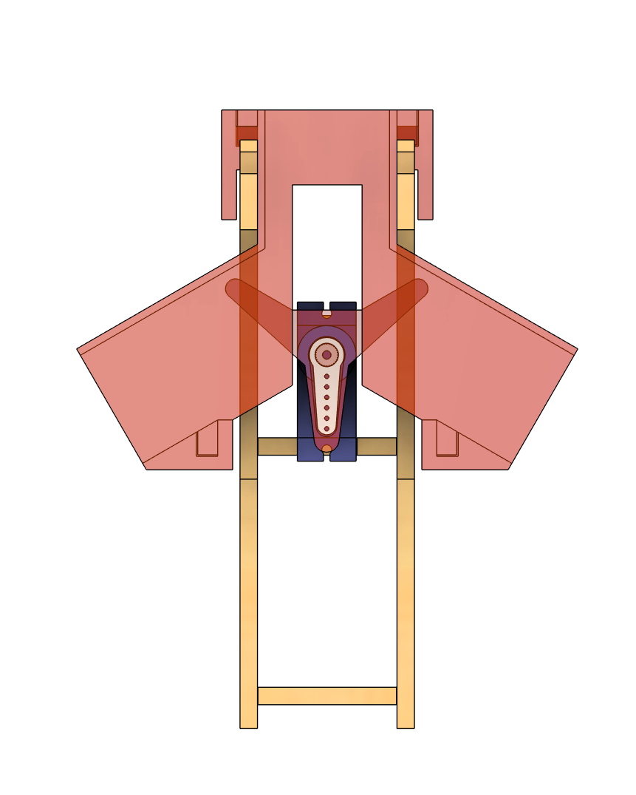

# Lil-Sorty

Welcome to our Designathon Project! This is Lil Sorty, as the name suggests, our little candy sorter. 

  
  

## What it does

This little candy sorter is going to sort your candy into different colours after being trained on what to do. 
It is going to use a machine learning model trained using Google's Teachable Machine software, the steps on how to do this are as follows:

## Prequisites
1. Install Python 3.10.11 from https://www.python.org/downloads/release/python-31011/
2. Install the requirements.txt
3. Install the Arduino IDE from https://docs.arduino.cc/software/ide/

## Equipment
1x Lil Sorty ;)  
1x Laptop  
1x Arduino Uno  
3x Male to Male Jumper Wires 

## Instructions

1. Connect the Arduino to the micro servo using the male-to-male jumper wires  
•	Red into 5V  
•	Brown into GND next to Red  
•	Orange into ~9  
2. Connect the other ends to the servo motor
3. 